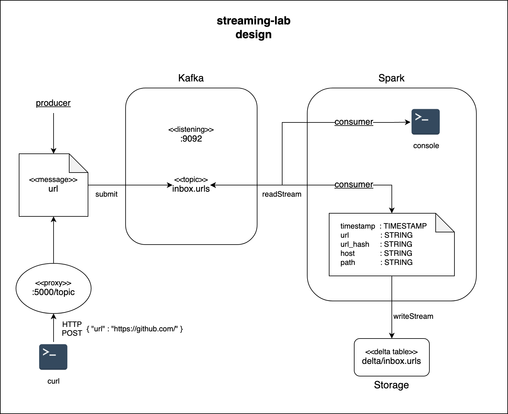

# streaming-lab
Example of how to use [Kafka](https://kafka.apache.org/) and [Spark](https://spark.apache.org/) to handle streaming submissions of urls.

# design


created using [design file](design.drawio.xml) on [diagrams.net](https://app.diagrams.net/)

# local Kafka

+ complete [Step 1](https://kafka.apache.org/quickstart#quickstart_download) and [Step 2](https://kafka.apache.org/quickstart#quickstart_startserver) of the Apache Kafka Quickstart.
+ open another terminal and run:
```
$ bin/kafka-topics.sh --create --topic inbox.urls --bootstrap-server localhost:9092 --partitions 1 --replication-factor 1
```
+ open another terminal and start the producer we come back to in order to feed the system urls:
```
$ bin/kafka-console-producer.sh --topic inbox.urls --bootstrap-server localhost:9092
```

# local Spark

+ [download](https://spark.apache.org/downloads.html) the latest release of Apache Spark, uncompress it and move the resulting directory to ~.
+ submit [consumer.py](consumer.py) to spark with support for Kafka and delta enabled:
```
bash ~/spark-3.1.2-bin-hadoop3.2/bin/spark-submit --packages org.apache.spark:spark-sql-kafka-0-10_2.12:3.1.2,io.delta:delta-core_2.12:1.0.0 --conf "spark.sql.extensions=io.delta.sql.DeltaSparkSessionExtension" --conf "spark.sql.catalog.spark_catalog=org.apache.spark.sql.delta.catalog.DeltaCatalog" --conf "spark.sql.ansi.enabled=false" ./consumer.py
```

# produce messages
+ copy a url from your browser
+ paste it into the kafka-console-producer window and hit Enter
+ watch the spark-submit terminal window to see the results

# http support
+ Kafka doesn't natively speak HTTP but this example demonstrates the idea
+ open another terminal and run:
```
python3 http_kafka_proxy.py
```
+ and in yet another terminal run:
```
curl --header "Content-Type: application/json" --request POST --data '{"url":"https://github.com/"}' localhost:5000/topic
```


# what's next?
+ layers of security
+ decide on a Kafka topic naming convention, and then:
+ prevent user created topics in Kafka:
```
auto.create.topics.enabled = false
```